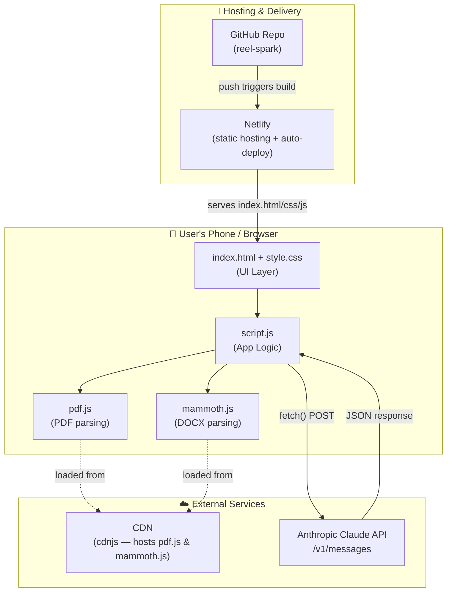
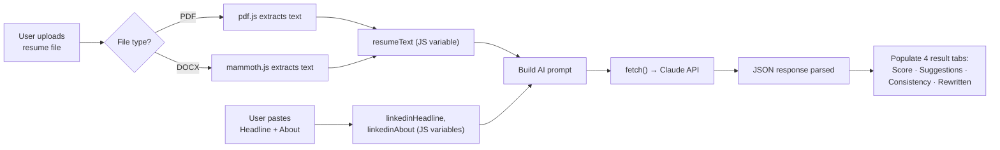
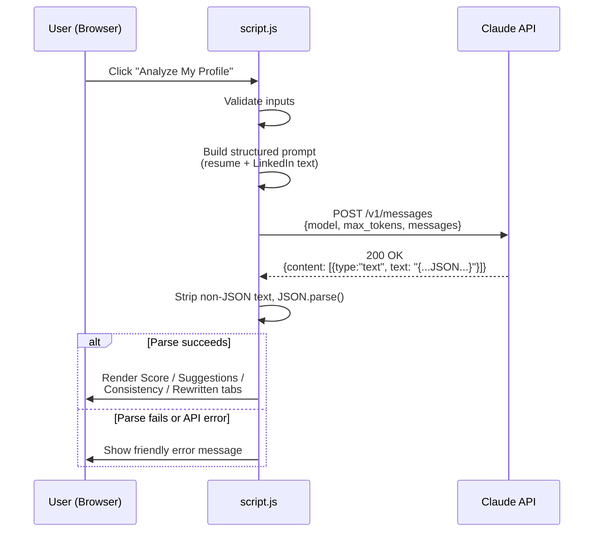

# Reel Spark — System Architecture

**Version:** v1.0 · **Date:** Day 2 · **Status:** Approved

This document describes the complete technical architecture of Reel Spark. It is the source of truth for how components fit together — no backend, no database, no authentication, per the approved PRD.

---

## 1. Architecture Style

Reel Spark is a **static, client-side single-page application**. There is no server we own or maintain. The browser does all the work: reading the resume file, building the AI prompt, calling the Claude API directly, and rendering the results.

**Key point:** There is no "our server" in this diagram. GitHub + Netlify only *deliver* the static files. All logic runs inside the user's browser.

---

## 2. Component Breakdown

| Component | Responsibility |
|---|---|
| `index.html` | Page structure: upload box, LinkedIn inputs, tab shells |
| `style.css` | Visual design, layout, responsiveness |
| `script.js` | All application logic: file handling, parsing, prompt building, API calls, tab switching, rendering results |
| `pdf.js` (CDN) | Extracts raw text from uploaded PDF resumes |
| `mammoth.js` (CDN) | Extracts raw text from uploaded DOCX resumes |
| Claude API | Performs the actual AI analysis and returns structured JSON |
| Netlify | Hosts the static files and auto-redeploys on every GitHub push |
| GitHub | Version control + trigger for Netlify deploys |

---

## 3. Data Flow

Nothing in this flow is written to a database or sent to any server we control — it flows entirely within the browser session and out to the Claude API only.

---

## 4. Request Lifecycle (Step by Step)

1. User opens the live Netlify link on their phone browser.
2. `index.html` + `style.css` + `script.js` load from Netlify's CDN.
3. User uploads a resume file → `script.js` detects file type → calls `pdf.js` or `mammoth.js` → stores extracted text in memory as `resumeText`.
4. User types/pastes LinkedIn Headline and About text into two input fields → stored in memory as `linkedinHeadline` and `linkedinAbout`.
5. User taps **"Analyze My Profile."**
6. `script.js` validates all required fields are filled; if not, shows an inline error and stops here.
7. Loading state is shown.
8. `script.js` builds one combined prompt (see `API.md`) and sends a single `fetch()` POST request to `https://api.anthropic.com/v1/messages`.
9. Claude processes the prompt and returns a JSON-structured text response.
10. `script.js` parses the response defensively (strips stray text, `JSON.parse()`s it inside a try/catch).
11. Loading state hides; the four result tabs are populated with the parsed data.
12. User browses tabs, uses "Copy" buttons to copy rewritten content.
13. Session ends when the user closes/refreshes the tab — nothing is saved anywhere (by design).

---

## 5. AI Interaction Detail

Full prompt structure, request/response shape, and error handling are documented in `API.md`.

---

## 6. External Services Used

| Service | Purpose | Cost |
|---|---|---|
| GitHub | Code storage + version control | Free |
| Netlify | Static hosting + auto-deploy from GitHub | Free tier |
| cdnjs (CDN) | Serves pdf.js and mammoth.js libraries | Free |
| Anthropic Claude API | AI analysis engine | Pay-per-use (kept minimal via single consolidated prompt, ~1000 max_tokens) |

---

## 7. Why No Backend?

This is an intentional decision (confirmed in PRD Section 5.2), not a limitation we ran into:

- Keeps the project buildable by someone with **no prior coding experience**, on a **mobile-only workflow**, within **1–2 hrs/day over 9 days**.
- Removes an entire category of setup (server hosting, database provisioning, backend auth) that isn't needed for a v1.0 demo tool.
- The known trade-off — the Claude API key is visible in client-side code — is accepted and documented transparently (see `API.md` §5 and the README). Moving this behind a Netlify Function is listed as optional Future Scope, not a v1.0 requirement.
