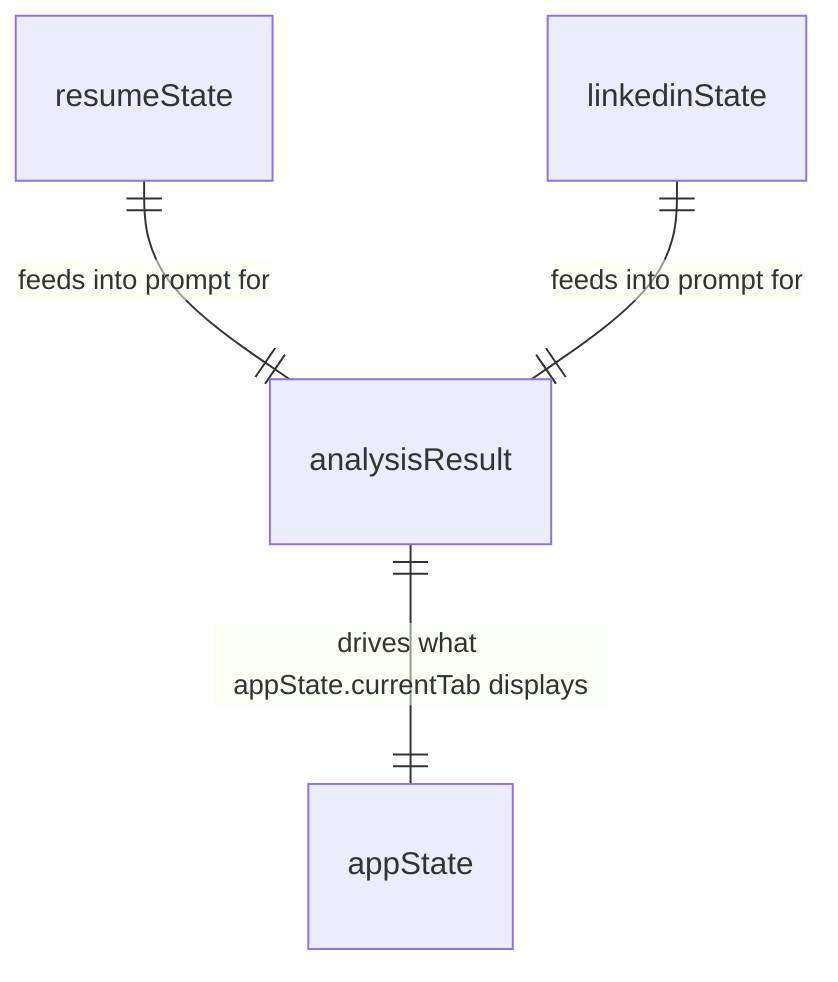

# Reel Spark — Data Model (Client-Side Only)

**Version:** v1.0 · **Date:** Day 2 · **Status:** Approved

Reel Spark has **no database**, by design (see PRD Section 5.2 and ARCHITECTURE.md §7). This document replaces a traditional "Database Design" section — instead it defines the **in-memory JavaScript data model** that holds information for the duration of a single browser session only. Nothing here is persisted; everything is cleared on page refresh/close.

---

## 1. Why No Database

- v1.0 has no login — there is no concept of "a user's account" to attach saved data to.
- Every analysis is a one-time, single-session action: upload → analyze → read results → copy content → done.
- Adding persistence would require a database + backend, which is explicitly out of scope for the 10-day capstone.

---

## 2. In-Memory Data Model

These are the JavaScript objects/variables `script.js` will hold during a session (documented here as the "schema" for Day 6–8 implementation to follow exactly).

### 2.1 `resumeState`
```js
resumeState = {
  fileName: string,        // e.g. "astha_resume.pdf"
  fileType: "pdf" | "docx",
  extractedText: string,   // raw text pulled out by pdf.js / mammoth.js
  isValid: boolean         // false if parsing failed or file rejected
}
```
**Constraints:**
- `fileType` must be one of `"pdf" | "docx"` — anything else is rejected before reaching this object.
- `extractedText` max practical size: not hard-capped, but very large resumes (>5MB file) are rejected at upload (see PRD §6.1).

### 2.2 `linkedinState`
```js
linkedinState = {
  headline: string,   // required, single line
  about: string        // required, multi-line
}
```
**Constraints:**
- Both fields are required (non-empty) before the "Analyze" button becomes active — enforced client-side (Day 9 validation work).

### 2.3 `analysisResult` (parsed from the Claude API response)
```js
analysisResult = {
  resume_score: number,            // 0–100
  resume_score_reason: string,
  linkedin_score: number,          // 0–100
  linkedin_score_reason: string,
  suggestions: string[],           // array of improvement tips

  consistency_check: {
    matches: string[],             // things that align well
    mismatches: [
      {
        issue: string,             // e.g. "Skill mismatch"
        explanation: string        // e.g. "Resume lists 'Python' — not found on LinkedIn"
      }
    ]
  },

  rewritten_headline: string,
  rewritten_about: string
}
```
**Constraints:**
- This entire object is the parsed `JSON.parse()` output of the Claude API's text response (see `API.md`).
- If parsing fails, `analysisResult` stays `null` and the UI shows an error state instead of partially-filled tabs.
- `mismatches` may be an empty array — the UI must handle this as a positive "no major mismatches" state, not a blank section (per Blueprint Day 7 debugging notes).

### 2.4 `appState` (UI/session state, not business data)
```js
appState = {
  currentTab: "score" | "suggestions" | "consistency" | "rewritten",
  isLoading: boolean,
  hasError: boolean,
  errorMessage: string | null
}
```

---

## 3. Relationships

Since there's no database, "relationships" here just describe how the in-memory objects connect during one analysis run:



- `resumeState` + `linkedinState` are combined into a single AI prompt.
- The AI's response becomes `analysisResult`.
- `appState.currentTab` decides which part of `analysisResult` is currently visible.

---

## 4. Validation Against PRD User Stories

| User Story (from PRD) | Covered by |
|---|---|
| Upload resume (PDF or DOCX) | `resumeState.fileName`, `fileType`, `extractedText`, `isValid` |
| Paste LinkedIn Headline + About | `linkedinState.headline`, `about` |
| See Resume Score + LinkedIn Score with explanation | `analysisResult.resume_score(_reason)`, `linkedin_score(_reason)` |
| See actionable suggestions | `analysisResult.suggestions[]` |
| See what matches / doesn't match between resume and LinkedIn | `analysisResult.consistency_check.matches[]`, `mismatches[]` |
| See AI-rewritten Headline and About | `analysisResult.rewritten_headline`, `rewritten_about` |
| Copy rewritten content | Reads directly from `analysisResult.rewritten_headline` / `rewritten_about` — no separate model needed |
| Tabbed navigation | `appState.currentTab` |
| Friendly error handling | `appState.hasError`, `errorMessage` |

Every PRD-required output has a corresponding field in this model — no gaps, no unused fields.

---

## 5. What Is Explicitly NOT Stored

- No resume files themselves (only extracted text, in memory)
- No user identity or account info
- No history of past analyses
- Nothing survives a page refresh — this is intentional and documented in the README so it's never mistaken for a bug.
