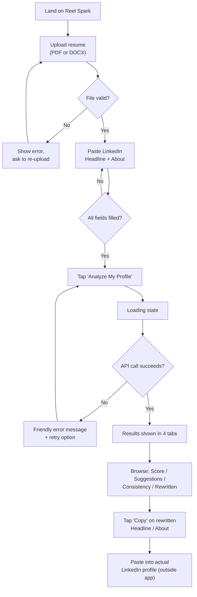
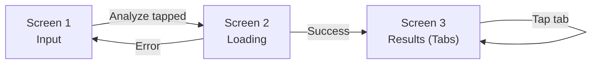

# Reel Spark — UI & User Flow

**Version:** v1.0 · **Date:** Day 2 · **Status:** Approved
Builds on the visual mood decided in Day 1 design notes (navy primary + teal accent, clean student-friendly tone).

---

## 1. User Flow Diagram



Every screen exists for exactly one reason in this flow — there is no screen a user can land on that isn't a direct step toward "get my improved profile."

---

## 2. Screen Flow (3 Screens Total)



Only **3 screens** in v1.0 — deliberately minimal, matching the PRD's "under a minute, zero setup" goal.

---

## 3. Low-Fidelity Wireframes

### Screen 1 — Input

```
┌─────────────────────────────────────┐
│  ⚡ REEL SPARK                        │
│  Spark your resume & LinkedIn        │
│                                       │
│  ┌─────────────────────────────────┐ │
│  │        📄  Drag & drop your      │ │
│  │        resume, or tap to browse  │ │
│  │        (.pdf or .docx)           │ │
│  └─────────────────────────────────┘ │
│                                       │
│  LinkedIn Headline                   │
│  ┌─────────────────────────────────┐ │
│  │ e.g. Aspiring Data Analyst |...  │ │
│  └─────────────────────────────────┘ │
│                                       │
│  LinkedIn About Section              │
│  ┌─────────────────────────────────┐ │
│  │                                   │ │
│  │  (multi-line textarea)           │ │
│  │                                   │ │
│  └─────────────────────────────────┘ │
│                                       │
│       [   Analyze My Profile   ]     │
│         (disabled until all           │
│          fields are filled)          │
└─────────────────────────────────────┘
```

### Screen 2 — Loading

```
┌─────────────────────────────────────┐
│  ⚡ REEL SPARK                        │
│                                       │
│                                       │
│              ⏳ (spinner)             │
│                                       │
│     "Reading your resume..."         │
│     (message cycles every few sec —  │
│      Day 9 polish)                   │
│                                       │
│                                       │
└─────────────────────────────────────┘
```

### Screen 3 — Results (Tabbed)

```
┌─────────────────────────────────────┐
│  ⚡ REEL SPARK                        │
│                                       │
│  [Score] [Suggestions] [Consistency] │
│  [Rewritten]                         │
│  ───────────────────────────────     │
│                                       │
│   Resume Score:      78 / 100        │
│   "Strong technical section, but..." │
│                                       │
│   LinkedIn Score:    65 / 100        │
│   "Headline is generic — could..."   │
│                                       │
│                                       │
└─────────────────────────────────────┘
```
*(Other 3 tabs share the same header/tab-bar frame; only the content area below changes — see Blueprint Day 5–8 for exact per-tab content.)*

---

## 4. Navigation Rules

- **No back/forward buttons needed** — it's a single-page flow; tabs are the only navigation once on Screen 3.
- **Active tab** is visually highlighted (per Day 2 color palette: teal underline/background on active tab).
- User can freely switch tabs in any order once results are loaded — no forced sequence.
- Re-running an analysis (e.g., after editing inputs) simply returns the user to Screen 1 state — no "start over" button needed since Screen 1 always remains reachable by scrolling up / the inputs are never destroyed until a new analysis is run.

---

## 5. Why Only 3 Screens

This directly protects the 10-day timeline: every extra screen (e.g., a separate "Welcome" screen, a "Settings" screen, a multi-step wizard) would add build time without adding value the PRD requires. Three screens is the minimum needed to deliver the full v1.0 feature set end to end.
